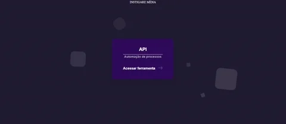

<a name="TOC"></a>

<h3 align="center">
  ECOMMERCE STORES API
</h3>

<div align="center">
  <a href="https://nodejs.org/en/"></a>
  <a href="https://www.github.com/lucasvtiradentes/ecommerce-stores-api/commits/master"></a>
  <br>
    <a href="#"></a>
  <a href="https://www.github.com/lucasvtiradentes"></a>
  <a href="https://github.com/lucasvtiradentes/ecommerce-stores-api#contributing"></a>
</div>

<p align="center">
  <a href="#dart-features">Features</a> • <a href="#warning-requirements">Requirements</a> • <a href="#wrench-development">Development</a> • <a href="#books-about">About</a> • <a href="#pray-help">Help</a> • <a href="#family-community">Community</a>
</p>

<details>
  <summary align="center"><span>see <b>table of content</b></span></summary>
  <p align="center">
    <ul>
      <!-- <li><a href="#trumpet-overview">Overview</a></li> -->
      <!-- <li><a href="#pushpin-table-of-contents">TOC</a></li> -->
      <li><a href="#dart-features">Features</a></li>
      <li><a href="#warning-requirements">Requirements</a></li>
      <li>
        <a href="#wrench-development">Development</a>
        <ul>
          <li><a href="#development-setup">Development setup</a></li>
          <li><a href="#folders-and-files-structure">Folders and files structure</a></li>
          <li><a href="#used-technologies">Used technologies</a></li>
          <li><a href="#commit-messages-style">Commit messages style</a></li>
        </ul>
      </li>
      <li>
        <a href="#pray-help">Help</a>
        <ul>
          <li><a href="#faq">FAQ</a></li>
          <li><a href="#docs-and-support">Docs and support</a></li>
        </ul>
      </li>
      <li>
        <a href="#books-about">About</a>
        <ul>
          <li><a href="#license">License</a></li>
        </ul>
      </li>
      <li>
        <a href="#family-community">Community</a>
        <ul>
          <li><a href="#contributing">Contributing</a></li>
          <li><a href="#feedback">Feedback</a></li>
          <li><a href="#acknowledgements">Acknowledgements</a></li>
        </ul>
      </li>
    </ul>
  </p>
</details>

<a href="#"></a>

## :trumpet: Overview

This is an ecommerce API designed to be useful for stores owners, as it allows some messaging automation, getting order information from Aliexpress and Shopify, among other things.

<div align="center">
  <a href="#"></a>
</div>

## :dart: Features<a href="#TOC"></a>

&nbsp;&nbsp;&nbsp;✔️ Whatsapp bot automation routes;<br>
&nbsp;&nbsp;&nbsp;✔️ Telegram bot automation routes;<br>
&nbsp;&nbsp;&nbsp;✔️ Get order information from Aliexpress;<br>
&nbsp;&nbsp;&nbsp;✔️ Get order information from Shopify;<br>
&nbsp;&nbsp;&nbsp;✔️ Get order information from Brazil post office, called Correios.<br>

## :warning: Requirements<a href="#TOC"></a>

In order to use this project in your computer, you need to have the following items:

- [npm](https://www.npmjs.com/): To install the package. Npm is installed alongside nodejs;
- [nodejs](https://nodejs.org/en/): To actually run the package.

If you want to make changes to the source code, it is recommended to also install the following items:

- [git](https://git-scm.com/): To work with version controlling;
- [vscode](https://code.visualstudio.com/): Useful for editing the code. You can choose a similar editor as you wish.

## :wrench: Development<a href="#TOC"></a>

### Development setup

To setup this project in your computer, download it in this link or run the following commands:

```bash
# Clone this repository
$ git clone https://github.com/lucasvtiradentes/ecommerce-stores-api

# Go into the repository
$ cd ecommerce-stores-api
```

After download it, go to the project folder and run these commands:

```bash
# Install dependencies
$ npm install

# Run the typescript code in development mode
$ npm run dev
```

If you want to contribute to the project, after you make the necessary changes, run these commands to check if everything is working fine:

```bash
# Compiles the typescript code into javascript
$ npm run build

# Run the compiled code in production mode
$ npm run start
```

### Folders and files structure

The project has the following folder strucure:

```plain
|-- .github      # contains CI-CD workflows, github templates, DOCS and images.
|-- build        # (dev only) build folder
|-- node_modules # (dev only) dependencies folder
|-- scripts      # scripts folder
|-- src          # application source code
```

and the filles present in root folder are the following:

```plain
.editorconfig    # editorconfig settings file
.env             # environmental variables
.env.example     # environmental variables example
.gitignore       # git ignored items
LICENSE          # project license
package.json     # project specifications
tsconfig.json    # typescript settings file
```

### Used technologies

This project uses the following thechnologies:

<div align="center">
  <table>
    <tr>
      <th>Scope</th>
      <th>Subject</th>
      <th>Technologies</th>
    </tr>
    <tr>
      <td rowspan="2">Main</td>
      <td>Main</td>
      <td align="center">
        <a href="https://nodejs.org/"></a>
        <a target="_blank" href="https://www.typescriptlang.org/"></a>
      </td>
    </tr>
    <tr>
      <!-- <td rowspan="2">Main</td> -->
      <td>Secondary</td>
      <td align="center">
        <a target="_blank" href="https://expressjs.com/pt-br/"></a>
        <a target="_blank" href="https://www.mongodb.com/"></a>
      </td>
    </tr>
    <!-- <tr> -->
      <!-- <td rowspan="3">Setup</td> -->
      <!-- <td>Code linting</td> -->
      <!-- <td align="center"> -->
        <!-- <a href="https://github.com/prettier/prettier"></a> -->
        <!-- <a href="https://github.com/eslint/eslint"></a> -->
      <!-- </td> -->
    <!-- </tr> -->
    <!-- <tr> -->
      <!-- <td rowspan="2">Setup</td> -->
      <!-- <td>Commit linting</td> -->
      <!-- <td align="center"> -->
      <!-- <a target="_blank" href="https://github.com/conventional-changelog/commitlint"></a> -->
      <!-- <a target="_blank" href="https://github.com/commitizen/cz-cli"></a> -->
      <!-- <a href="https://gitmoji.dev"></a> -->
      <!-- </td> -->
    <!-- </tr> -->
    <tr>
      <td rowspan="1">Setup</td>
      <td>Other</td>
      <td align="center">
        <a href="https://editorconfig.org/"></a>
        <!-- <a target="_blank" href="https://github.com/typicode/husky"></a> -->
        <!-- <a target="_blank" href="https://github.com/okonet/lint-staged"></a> -->
      </td>
    </tr>
  </table>
</div>

And also this project used the following packages:

```plain
# DEPENDENCIES

- @adiwajshing/baileys           # whatsapp api wrapper.
- @wmakeev/base64encode          # deal with base64 codification.
- axios                          # deal with https request.
- bull                           # related to multi-threading.
- cli-color                      # prits colorful console messages.
- cluster                        # fork process to run specific tasks.
- cors                           # specify who can use the api routes.
- dotenv                         # read all .env variables at runtime.
- express                        # create backend servers.
- mongodb                        # mongodb database package.
- mongoose                       # ORM to deal with mongodb.
- node-telegram-bot-api          # telegram api wrapper package.
- pino                           # logger library.
- puppeteer-extra                # puppeteer with some cool plugins.
- puppeteer-extra-plugin-stealth # plugin for stealth navigation at puppeteer.
- qrcode                         # deal with qrcode operations.
- throng                         # related to multi-threading.
- uuid                           # generate random strings

# DEV DEPENDENCIES

- npm-run-all                    # run multiple scripts simultaneously.
- rimraf                         # cross-platform delete folder utility.
- ts-node                        # run typescript code in development.
- ts-node-dev                    # restart the typescript code after changes.
- typescript                     # typescript main package.
```

### Commit messages style

This project uses the best of two main conventions to commit messages validation:

- [conventional commits](https://www.conventionalcommits.org/en/v1.0.0/): it's powerfull messages structure;
- [gitmoji](https://gitmoji.dev/): it's beutiful and visual way to display commits.

So a typically valid commit message has this pattern:

> 🔧 config: add lint-staged to the project (#2)

Also, in order to have this integration working correctly, I buld a [script](../scripts/update-commits-configs.ts) that we can specify only allowed types and it take care to update both commitizen and commitlint settings.

<a href="#"></a>


## :pray: Help<a href="#TOC"></a>

## FAQ

You can check our most common questions and awnsers in this [link](../docs/FAQ.MD).

## Docs and support

The first point of call should be our [Github discussions](https://github.com/lucasvtiradentes/ecommerce-stores-api/discussions). Ask your questions about bugs or specific use cases, and someone from the will respond.
Or, if you prefer, [open an issue](https://github.com/lucasvtiradentes/ecommerce-stores-api/issues) on our GitHub repo.

<a href="#"></a>


## :books: About<a href="#TOC"></a>

## License

**Boilermanager** is distributed under the terms of the MIT License Version 2.0. A complete version of the license is available in the [LICENSE](LICENSE) file in this repository. Any contribution made to this project will be licensed under the MIT License Version 2.0.

<a href="#"></a>

## :family: Community<a href="#TOC"></a>

## Contributing

If you are a typescript developer, we would kind and happy accept your help:

- The best way to get started is to select any issue from the [`good-first-issue`](https://github.com/lucasvtiradentes/ecommerce-stores-api/labels/good%20first%20issue) label;
- If you would like to contribute, please review our [Contributing Guide](docs/CONTRIBUTING.md) for all relevant details.

Another ways to positivily impact this project is to:

- **:star: Star this repository**: my goal is to impact the maximum number of developers around the world;
- ✍️ **Fix english mistakes** I might have made in this project, may it be in the DOCS or even in the code (I'm a portuguese natural speaker);
- [:heart: Say thanks](https://saythanks.io/to/lucasvtiradentes): kind words have a huge impact in anyone's life;
- [💰 Donate](https://github.com/lucasvtiradentes): if you want to support my work even more, consider make a small donation. I would be really happy!

## Feedback

Any questions or suggestions? You are welcome to discuss it on:

- [Github issues](https://github.com/lucasvtiradentes/ecommerce-stores-api/issues)
- [Email](mailto:lucasvtiradentes@gmail.com)

## Acknowledgements

This project is an idea of [@lucasvtiradentes](https://github.com/lucasvtiradentes) to `return some value to the world` after years of consuming a lot of useful tools provided by this `amazing open source community`.

<a href="#"></a>

<div align="center">
  <p>
    <a target="_blank" href="https://www.linkedin.com/in/lucasvtiradentes/"></a>
    <a target="_blank" href="mailto:lucasvtiradentes@gmail.com"></a>
    <a target="_blank" href="https://discord.com/users/262326726892191744"></a>
    <a target="_blank" href="https://github.com/lucasvtiradentes/"></a>
  </p>
  <p>Made with ❤️ by Lucas Vieira.</p>
  <p>👉 See also all <a href="https://github.com/lucasvtiradentes/lucasvtiradentes/blob/master/portfolio/PROJECTS.md#TOC">my projects</a></p>
  <p>👉 See also all <a href="https://github.com/lucasvtiradentes/my-tutorials#readme">my articles</a></p>
</div>
